+++
title = "Love2D"
weight = 1
[params]
  author = 'Samy, Umar et Ashank'
+++
# 1.Introduction à LOVE2D
LÖVE2D, souvent appelé Love2D, est un framework open-source destiné à la création de jeux vidéo en 2D. Il utilise le langage de programmation Lua, reconnu pour sa simplicité, sa rapidité et sa facilité de prise en main. Love2D rend le développement très accessible grâce à sa structure claire et à son fonctionnement basé sur une boucle de jeu déjà intégrée, ce qui évite au développeur de devoir gérer lui-même les rafraîchissements de l’écran ou le timing des images.

Lua étant un langage interprété, l'exécution est rapide et les tests sont quasi immédiats, ce qui favorise l’expérimentation. Love2D est aussi extrêmement léger : un projet peut être constitué d’un seul fichier main.lua, ce qui permet aux débutants de se concentrer sur la logique du jeu plutôt que sur la configuration d’un environnement complexe.

Love2D repose sur trois fonctions fondamentales qui définissent la structure d’un projet :

```Lua
function love.load() end     -- exécuté une seule fois au début
function love.update(dt) end -- logique du jeu (environ 60fps)
function love.draw() end     --  partie visuelle du jeu
```

love.load() sert à initialiser les variables, charger les ressources et configurer le jeu. love.update(dt) traite les déplacements, animations, collisions ou IA. Le paramètre dt (delta time) représente le temps écoulé entre deux frames, ce qui permet d’avoir des mouvements constants quel que soit le FPS. Enfin, love.draw() se charge de tout l’affichage : texte, images, formes, sprites animés, etc.
## Installation

Télécharger LOVE2D ici :
https://love2d.org/


## 1.1 - Un exemple minimal 
Créer un fichier `main.lua` :

```txt
Projet-1-Hello/
    main.lua
```
Commande pour afficher un texte:
```Lua
function love.draw()
    love.graphics.print("Hello Love2D!", 100, 100)
end

```
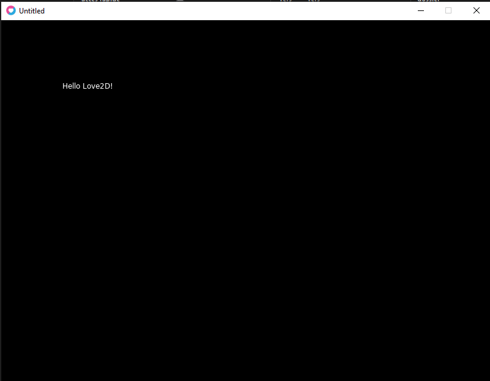

## 1.2 - Demarrer un jeu avec Love2D (Drag and Drop)

1. Ouvrir `C:\Program Files\LOVE`
2. Trouver `love.exe`
3. Ouvrir l’explorateur Windows dans ton projet
4. Glisser ton dossier ENTIER sur `love.exe`

Comme ceci :

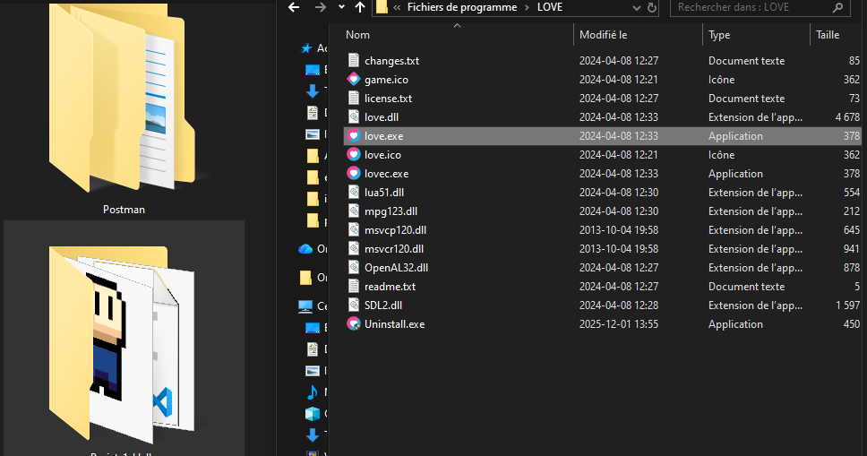

Projet-1-Hello -> glisser sur love.exe  
Le jeu démarre automatiquement 🎮

---

# 2.Graphismes : formes, couleurs & images

Cette section couvre tout ce qu’un débutant doit savoir pour **afficher du texte**, **dessiner des formes**, **changer les couleurs**, et **afficher des images** dans Love2D.  
L’objectif est de comprendre comment Love2D dessine à l’écran : chaque élément visuel, qu’il s’agisse d’un rectangle, d’un cercle ou d’un sprite complet, passe par les fonctions du module `love.graphics`.  
Cette base est essentielle pour tous les jeux 2D, qu’ils soient simples ou avancés.

---

## 2.1 - Exemple complet : formes + couleurs

Dans cet exemple, on montre comment changer la couleur actuelle du pinceau de dessin, puis comment afficher un rectangle, un cercle et enfin du texte.  
Love2D redessine l’écran **à chaque frame**, donc tout ce qui doit apparaître visuellement doit être dans `love.draw()`.

```lua
function love.load()
    -- rien à charger ici
end

function love.update(dt)
    -- logique du jeu (vide pour ce chapitre)
end

function love.draw()
    -- carré rouge
    love.graphics.setColor(1, 0, 0, 1)
    love.graphics.rectangle("fill", 50, 50, 120, 80)

    -- cercle bleu
    love.graphics.setColor(0, 0, 1, 1)
    love.graphics.circle("fill", 300, 150, 40)

    -- texte en blanc
    love.graphics.setColor(1, 1, 1, 1)
    love.graphics.print("Hello Love2D!", 50, 200)
end
```
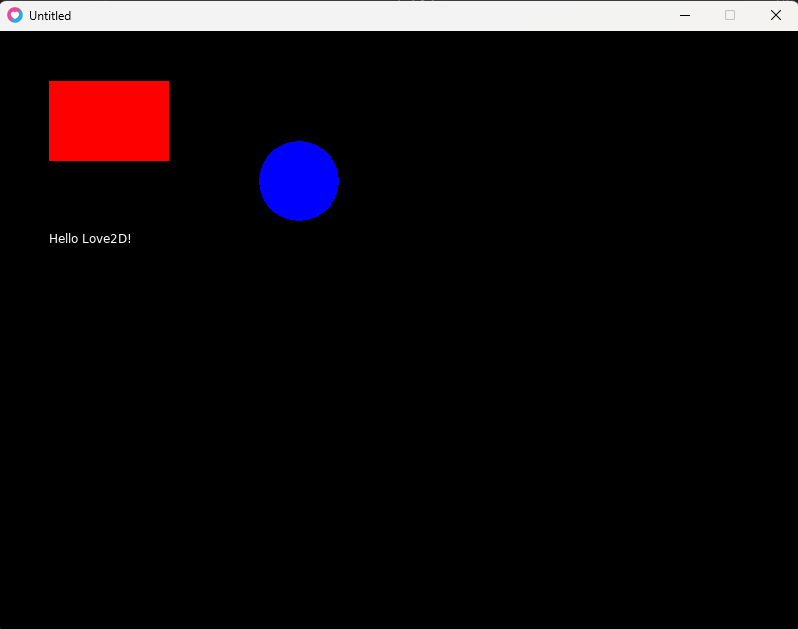
---
Cet exemple montre trois choses essentielles :

1. Comment modifier la couleur courante (setColor)

2. Comment dessiner des formes simples (rectangle, circle)

3. Comment afficher du texte (print)

## 2.2 - Afficher une image
Pour afficher une image, elle doit être placée dans un dossier accessible au jeu.
Voici une structure recommandée pour éviter les erreurs de chemin :
```txt
afficherimage/
    main.lua
    assets/
        images/
            player.png
```
Voici le code complet pour charger et afficher une image :
```lua
local playerImg
local playerX = 200
local playerY = 200

function love.load()
    playerImg = love.graphics.newImage("assets/images/player.png")
end

function love.update(dt)
    -- rien pour l'instant
end

function love.draw()
    love.graphics.setColor(1, 1, 1, 1) -- reset couleur
    love.graphics.draw(playerImg, playerX, playerY)
end

```
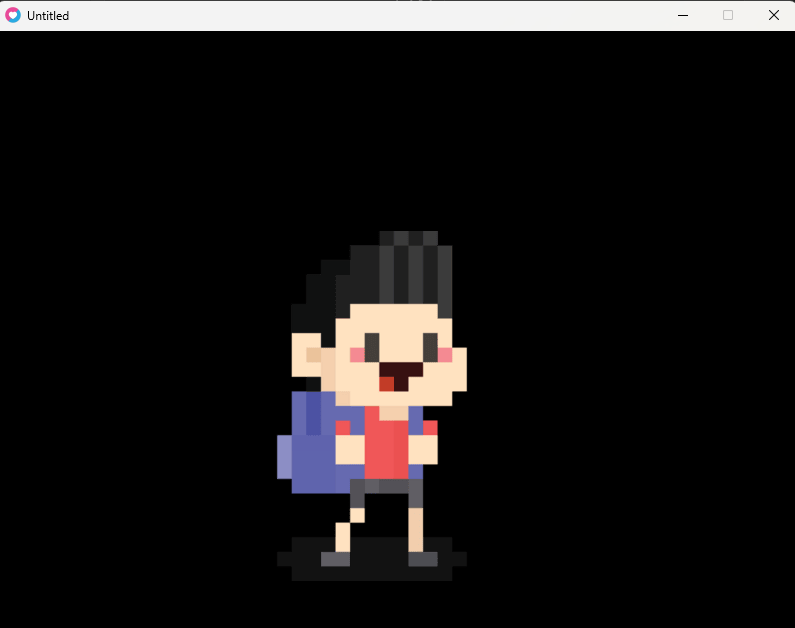
---
Ce code démontre :

1. Comment charger une image avec newImage()

2. Comment stocker la position du sprite

3. Comment afficher l’image dans love.draw()

## 2.3 - Déplacer une image avec une variable
Dans cet exemple, l'image se déplace automatiquement en modifiant sa position à chaque frame.
dt permet d’assurer un déplacement fluide et stable même si le nombre de FPS change.

```lua
local img
local x = 100
local y = 100
local speed = 200 -- pixels/sec

function love.load()
    img = love.graphics.newImage("assets/images/player.png")
end

function love.update(dt)
    x = x + speed * dt      -- mouvement automatique horizontal
end

function love.draw()
    love.graphics.draw(img, x, y)
end
```

Ici, l’image se déplace vers la droite grâce à l’ajout progressif de speed * dt.
C’est le principe fondamental du mouvement dans presque tous les jeux 2D.


---
## 2.4 - Quelques exercises pour mettre en pratique cette section

Les exercices suivants  permettent de pratiquer immédiatement les concepts vus ci-dessus.
Chaque exercice correspond à une action simple mais essentielle pour se familiariser avec les bases de l’affichage.

---
### 1. Dessiner un rectangle rouge
Le Resultat: 

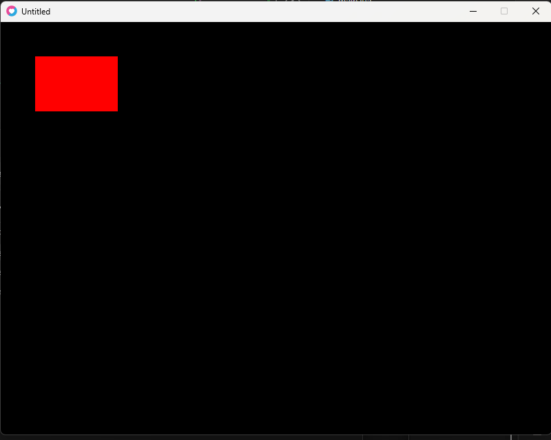

Cet exercice vérifie que tu sais utiliser setColor et rectangle.

---
### 2. Dessiner un cercle bleu
Resultat: 

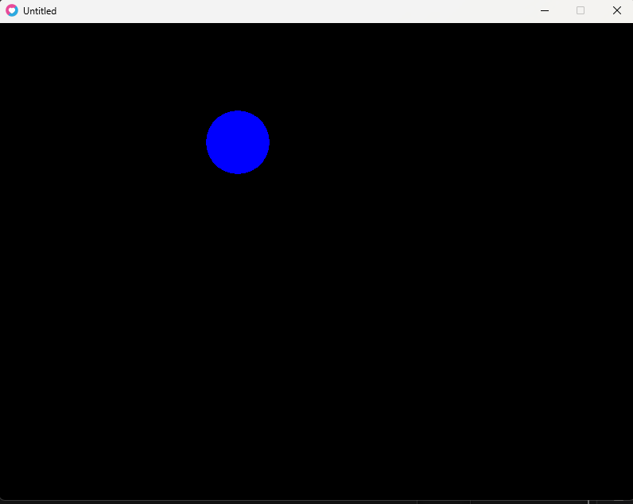

Cet exercice valide la manipulation de formes simples et les couleurs.

---
### 3. Afficher une image player.png

Resultat:


Cela confirme que tu maîtrises la structure des dossiers et le chargement d’images avec newImage.

---
### 4. Déplacer une image avec une variable

Resultat:

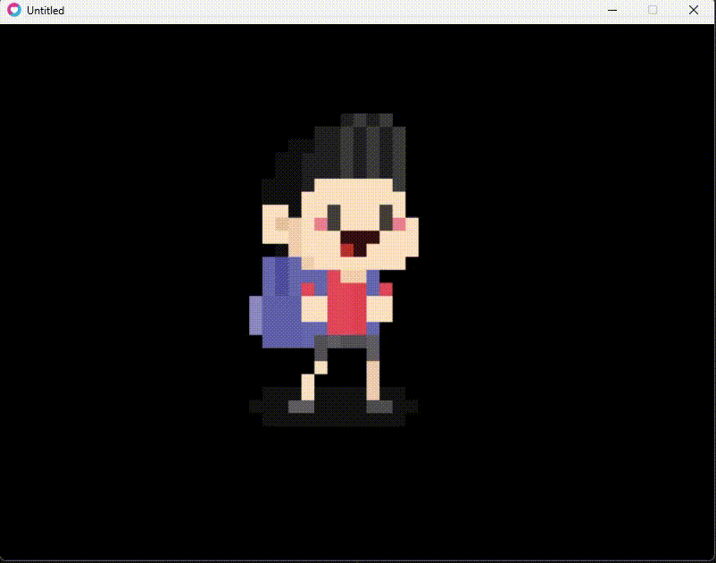
Cet exercice t’aide à comprendre la logique de mouvement, la mise à jour d’une position, et l’importance du delta time.

---

# 3. Déplacements & Input clavier
Dans cette section, on apprend à contrôler un personnage avec le clavier, à appliquer un déplacement fluide grâce au `dt`, et à empêcher l’objet de sortir de l’écran. Ce sont les mécaniques fondamentales de presque tous les jeux 2D réalisés avec Love2D.  
L’objectif est simple : comprendre comment lire les touches, modifier des positions, et utiliser la logique de mise à jour frame par frame pour obtenir un mouvement naturel et constant.

---

## 3.1 - Lire les touches avec love.keyboard.isDown

Love2D permet de détecter en continu si une touche est enfoncée grâce à :

```lua
love.keyboard.isDown("touche")
```

Si une touche est maintenue, Love2D renvoie true.
Cela permet un mouvement fluide, contrairement à love.keypressed qui ne détecte qu’un seul événement.

Exemple de déplacement vertical :

```lua
if love.keyboard.isDown("w") then
    player.y = player.y - player.speed * dt
end
if love.keyboard.isDown("s") then
    player.y = player.y + player.speed * dt
end
```
---

## 3.2 — Exemple complet : déplacement WASD fluide

Voici un projet complet qui gère la vitesse, le déplacement fluide, et le rendu à l’écran :

```lua
local player = {
    x = 200,
    y = 200,
    speed = 200
}

function love.update(dt)
    if love.keyboard.isDown("w") then
        player.y = player.y - player.speed * dt
    end
    if love.keyboard.isDown("s") then
        player.y = player.y + player.speed * dt
    end
    if love.keyboard.isDown("a") then
        player.x = player.x - player.speed * dt
    end
    if love.keyboard.isDown("d") then
        player.x = player.x + player.speed * dt
    end
end

function love.draw()
    love.graphics.circle("fill", player.x, player.y, 20)
end

```

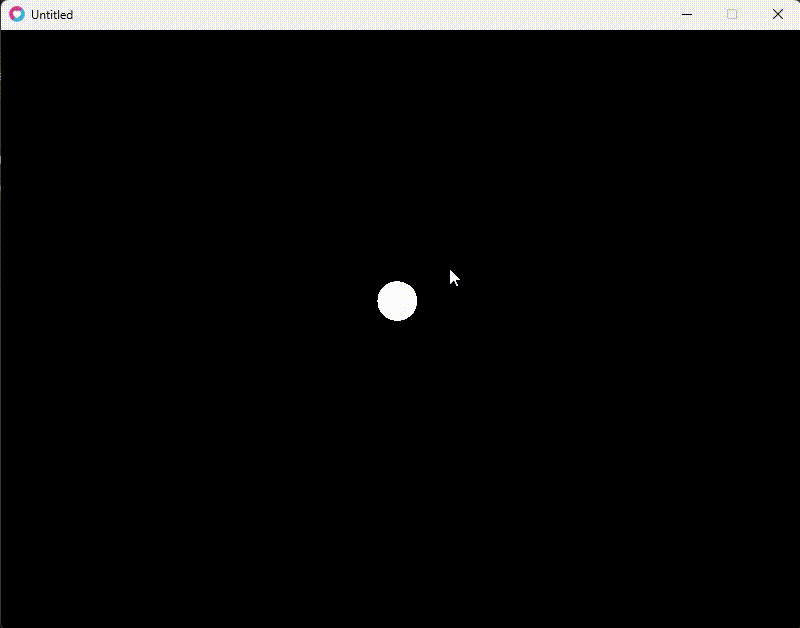


Ce code crée un joueur représenté par un cercle et lui permet de se déplacer librement dans toutes les directions en respectant le temps réel (dt).

---
## 3.3 - Déplacement diagonal

Comme plusieurs touches peuvent être pressées simultanément, le personnage peut se déplacer en diagonale.

Exemple :
```txt

w + d -> haut droite

w + a -> haut gauche

s + d -> bas droite

s + a -> bas gauche
```
Ce comportement est automatiquement géré par le système sans rien de plus à faire.

---
## 3.4 - Empêcher le joueur de sortir de l’écran (Clamping)

Pour éviter que le joueur disparaisse hors de la fenêtre, on vérifie constamment s’il dépasse les limites.

```lua

function clampPlayer()
    local width = love.graphics.getWidth()
    local height = love.graphics.getHeight()

    if player.x < 20 then player.x = 20 end
    if player.y < 20 then player.y = 20 end

    if player.x > width - 20 then player.x = width - 20 end
    if player.y > height - 20 then player.y = height - 20 end
end
```
Puis dans love.update :
'''lua
clampPlayer()
'''

Ceci garantit que le joueur reste visible à l’écran en tout temps.

---

## 3.5 - Exemple complet avec clamping + déplacement

Voici un exemple propre montrant un déplacement fluide + limites de l’écran :

```lua

local player = {
    x = 200,
    y = 200,
    speed = 220,
    radius = 20
}

local function clampPlayer()
    local w = love.graphics.getWidth()
    local h = love.graphics.getHeight()

    if player.x < player.radius then player.x = player.radius end
    if player.x > w - player.radius then player.x = w - player.radius end

    if player.y < player.radius then player.y = player.radius end
    if player.y > h - player.radius then player.y = h - player.radius end
end

function love.update(dt)
    if love.keyboard.isDown("w") then
        player.y = player.y - player.speed * dt
    end
    if love.keyboard.isDown("s") then
        player.y = player.y + player.speed * dt
    end
    if love.keyboard.isDown("a") then
        player.x = player.x - player.speed * dt
    end
    if love.keyboard.isDown("d") then
        player.x = player.x + player.speed * dt
    end

    clampPlayer()
end

function love.draw()
    love.graphics.setColor(1, 1, 1)
    love.graphics.circle("fill", player.x, player.y, player.radius)
end
```

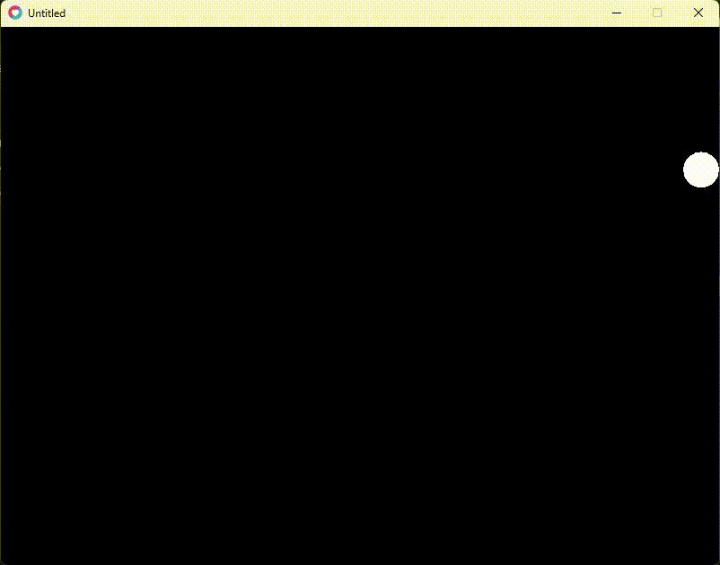

Cet exemple reflète exactement la logique utilisée dans les vrais jeux : une boucle de mise à jour, un mouvement fluide, et un contrôle strict des limites.

---

## 3.6 - Exercices pour maîtriser cette section

### Exercice 1 : Déplacement WASD

Reprendre l’exemple et déplacer un carré plutôt qu’un cercle.

---

### Exercice 2 : Déplacement avec les flèches du clavier

Remplacer WASD par :
"up", "down", "left", "right"

---


### Exercice 3 : Vitesse variable

Ajouter une touche (ex : Shift) qui double la vitesse.

---


### Exercice 4 : Empêcher de sortir de l’écran

Écrire votre propre fonction clamp() pour pratiquer.

---


### Exercice 5 : Inverser les contrôles

Quand on appuie sur “E”, inverser WASD pendant 3 secondes.

---

# 4. Collisions simples (rectangle vs rectangle)

Cette section explique comment détecter une collision entre deux objets en 2D.  
Dans Love2D, la méthode la plus utilisée pour les jeux débutants est la collision **AABB** (Axis Aligned Bounding Box), c’est-à-dire une collision entre deux rectangles alignés sur les axes.  
C’est une méthode simple, rapide et suffisante pour la majorité des jeux 2D sans rotation.

---

## 4.1 - Comprendre la collision AABB

Deux rectangles `A` et `B` sont en collision si **leurs bords se chevauchent sur les axes X et Y** en même temps.

Love2D ne fournit pas de fonction toute faite, donc on crée notre propre fonction.

---

## 4.2 - Fonction de collision complète

Voici le code que tout le monde utilise pour détecter une collision rectangle vs rectangle :

```lua
function checkCollision(a, b)
    return  a.x < b.x + b.w and
            b.x < a.x + a.w and
            a.y < b.y + b.h and
            b.y < a.y + a.h
end
```
Si la fonction retourne true, alors il y a contact.

---

## 4.3 - Exemple complet : joueur vs obstacle

Voici un petit projet entier montrant un joueur, un obstacle fixe, et un test de collision :

```lua

local player = { x = 50, y = 50, w = 40, h = 40, speed = 200 }
local box = { x = 250, y = 120, w = 80, h = 80 }
local message = ""

function checkCollision(a, b)
    return  a.x < b.x + b.w and
            b.x < a.x + a.w and
            a.y < b.y + b.h and
            b.y < a.y + a.h
end

function love.update(dt)
    if love.keyboard.isDown("w") then player.y = player.y - player.speed * dt end
    if love.keyboard.isDown("s") then player.y = player.y + player.speed * dt end
    if love.keyboard.isDown("a") then player.x = player.x - player.speed * dt end
    if love.keyboard.isDown("d") then player.x = player.x + player.speed * dt end

    if checkCollision(player, box) then
        message = "Collision !"
    else
        message = ""
    end
end

function love.draw()
    -- joueur (bleu)
    love.graphics.setColor(0, 0.4, 1)
    love.graphics.rectangle("fill", player.x, player.y, player.w, player.h)

    -- obstacle (rouge)
    love.graphics.setColor(1, 0, 0)
    love.graphics.rectangle("fill", box.x, box.y, box.w, box.h)

    -- message
    love.graphics.setColor(1, 1, 1)
    love.graphics.print(message, 50, 20)
end
```
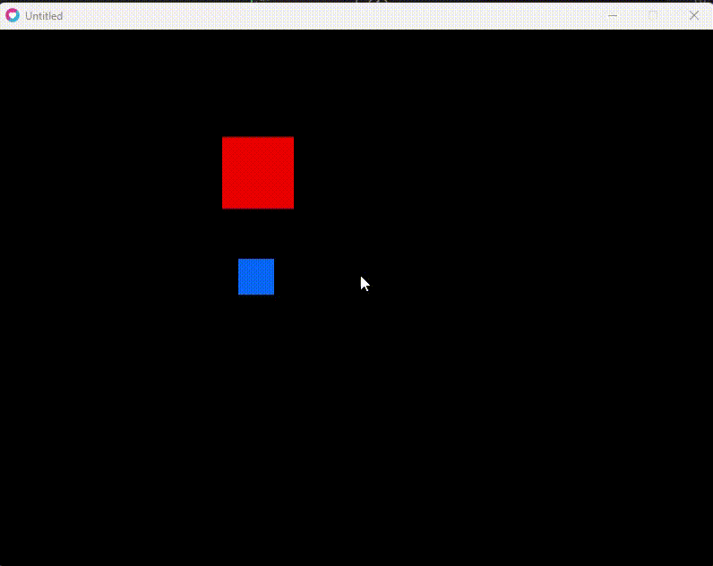

Ce programme affiche un carré bleu contrôlable et un carré rouge immobile.
Lorsque les deux se touchent, le texte “Collision !” apparaît.

---

## 4.4 - Collision cercle vs cercle (optionnel)

Si vous utilisez des cercles, voici la version collision circulaire :


```lua

function circleCollision(x1, y1, r1, x2, y2, r2)
    local dx = x2 - x1
    local dy = y2 - y1
    local dist = math.sqrt(dx*dx + dy*dy)
    return dist < r1 + r2
end
```

Cette méthode est idéale pour les jeux avec boules, projectiles ou ennemis ronds.

---

## 4.5 - Exemple : joueur rond vs ennemi rond

```lua

local px, py, pr = 120, 200, 20
local ex, ey, er = 300, 200, 30
local hit = false

function circleCollision(x1, y1, r1, x2, y2, r2)
    local dx = x2 - x1
    local dy = y2 - y1
    local dist = math.sqrt(dx*dx + dy*dy)
    return dist < r1 + r2
end

function love.update(dt)
    if love.keyboard.isDown("right") then px = px + 200*dt end
    if love.keyboard.isDown("left")  then px = px - 200*dt end

    hit = circleCollision(px, py, pr, ex, ey, er)
end

function love.draw()
    if hit then love.graphics.setColor(1, 0, 0) else love.graphics.setColor(0, 1, 0) end
    love.graphics.circle("fill", px, py, pr)

    love.graphics.setColor(1, 1, 1)
    love.graphics.circle("line", ex, ey, er)
end
```
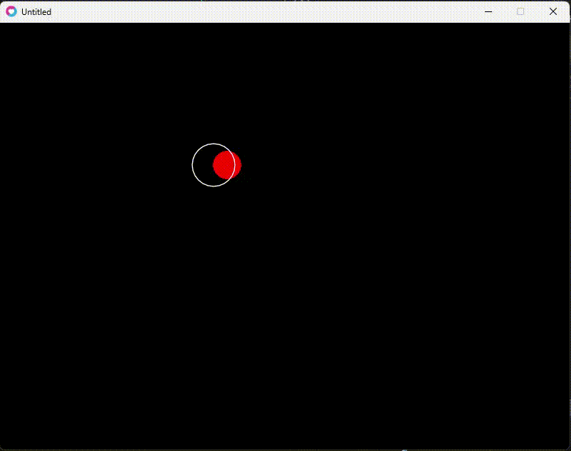

Si il y a une collision le joueur devient rouge.
Sinon il reste vert.

---

## 4.6 - Exercices pour pratiquer
### Exercice 1 : Détecter une collision entre joueur et un carré fixe

Changer le message “Collision !” par “Touché !”.

### Exercice 2 : Faire disparaître un carré lorsqu’on le touche

Set box.visible = false.

### Exercice 3 : Changer la couleur du joueur lorsqu’il touche l’obstacle

Bleu par défaut, jaune en collision.

### Exercice 4 : Collision ronde

Créer un joueur rond + un obstacle rond et détecter la collision.

### Exercice 5 : Ajouter plusieurs obstacles

Créer un tableau obstacles = { ... } et tester tous les obstacles avec une boucle.

---

# 5. Mouvements automatiques & rebonds

Cette section introduit les mouvements autonomes, c’est-à-dire des objets qui se déplacent sans intervention du joueur.  
On apprend aussi à faire rebondir un objet sur les murs de la fenêtre, une mécanique essentielle pour créer des ennemis mobiles, des projectiles, ou des objets dynamiques.

Le principe est simple :  
- l’objet possède une vitesse horizontale (speedX)  
- l’objet possède une vitesse verticale (speedY)  
- à chaque frame, on met à jour sa position  
- si l’objet frappe un mur -> on inverse la direction

---

## 5.1 - Exemple simple : carré qui bouge tout seul

Dans cet exemple, un carré se déplace en diagonale grâce aux vitesses speedX et speedY.

```lua
local box = {
    x = 100,
    y = 100,
    w = 50,
    h = 50,
    speedX = 180,
    speedY = 140
}

function love.update(dt)
    box.x = box.x + box.speedX * dt
    box.y = box.y + box.speedY * dt
end

function love.draw()
    love.graphics.setColor(1, 0, 0)
    love.graphics.rectangle("fill", box.x, box.y, box.w, box.h)
end
```
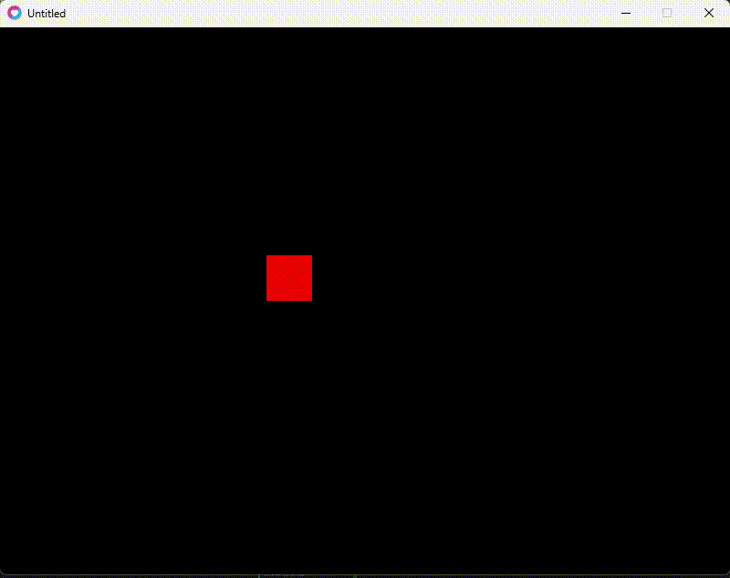

Ce code donne un mouvement continu, sans contrôle du joueur.

---

## 5.2 - Faire rebondir l’objet sur les murs

On teste les limites :

si l’objet dépasse la gauche -> on inverse speedX

droite -> inverse speedX

haut -> inverse speedY

bas -> inverse speedY

```lua
local box = {
    x = 100,
    y = 100,
    w = 50,
    h = 50,
    speedX = 180,
    speedY = 140
}

function love.update(dt)
    box.x = box.x + box.speedX * dt
    box.y = box.y + box.speedY * dt

    local screenW = love.graphics.getWidth()
    local screenH = love.graphics.getHeight()

    if box.x < 0 then
        box.x = 0
        box.speedX = -box.speedX
    end

    if box.x + box.w > screenW then
        box.x = screenW - box.w
        box.speedX = -box.speedX
    end

    if box.y < 0 then
        box.y = 0
        box.speedY = -box.speedY
    end

    if box.y + box.h > screenH then
        box.y = screenH - box.h
        box.speedY = -box.speedY
    end
end

function love.draw()
    love.graphics.setColor(1, 0.2, 0.2)
    love.graphics.rectangle("fill", box.x, box.y, box.w, box.h)
end

```

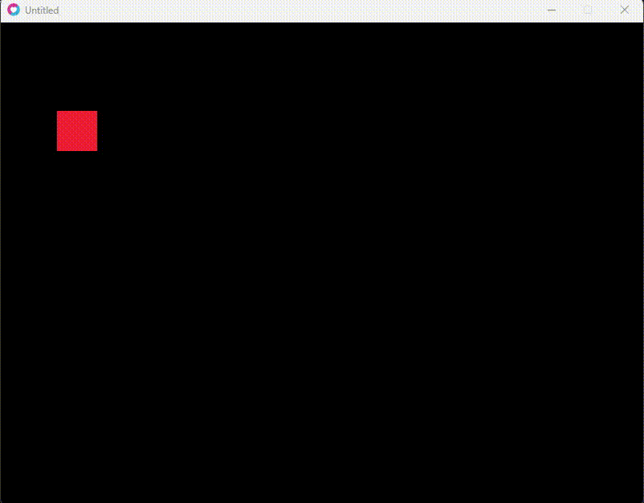

Ce code crée un mouvement “pong-like”, parfait pour un objet autonome.

---

## 5.3 - Exemple avec une image au lieu d’un rectangle

Le même principe, mais avec un sprite :

```lua

local img
local x = 200
local y = 120
local speedX = 150
local speedY = 190
local w, h = 0, 0

function love.load()
    img = love.graphics.newImage("assets/images/player.png")
    w, h = img:getWidth(), img:getHeight()
end

function love.update(dt)
    x = x + speedX * dt
    y = y + speedY * dt

    local sw = love.graphics.getWidth()
    local sh = love.graphics.getHeight()

    if x < 0 then
        x = 0
        speedX = -speedX
    end
    if x + w > sw then
        x = sw - w
        speedX = -speedX
    end
    if y < 0 then
        y = 0
        speedY = -speedY
    end
    if y + h > sh then
        y = sh - h
        speedY = -speedY
    end
end

function love.draw()
    love.graphics.setColor(1, 1, 1)
    love.graphics.draw(img, x, y)
end
```
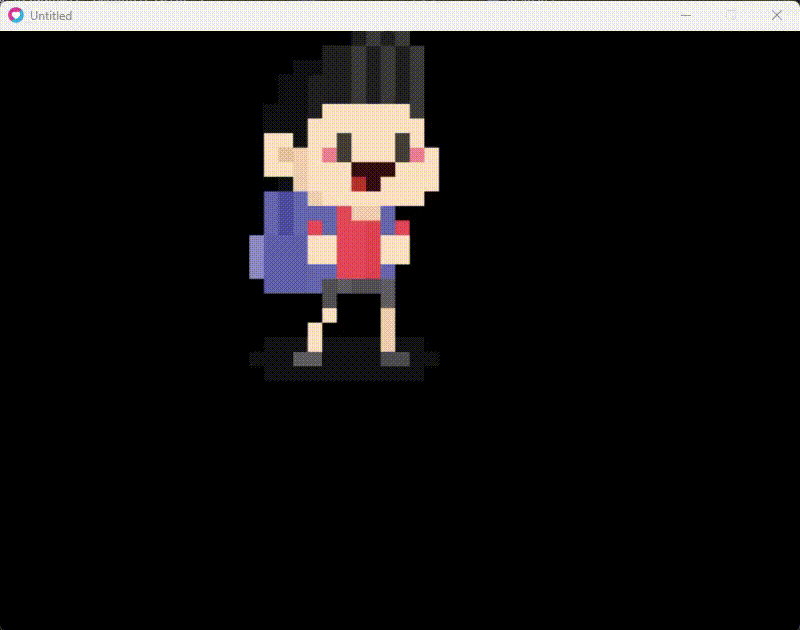


Un sprite se déplace et rebondit parfaitement dans l’écran.

---

## 5.4 - Ajouter une accélération progressive (optionnel)

Exemple avec vitesse qui augmente graduellement :

```lua

speedX = speedX + 10 * dt
speedY = speedY + 10 * dt

```

Cela crée un comportement plus chaotique ou plus “vivant”.

---

## 5.5 - Changer de direction aléatoirement

On peut faire changer la direction un peu comme dans des jeux d’ennemis imprévisibles :

```lua
if math.random() < 0.01 then
    speedX = speedX * -1
end
if math.random() < 0.01 then
    speedY = speedY * -1
end
```

Ce genre de mouvement donne un effet organique ou erratique.

---

## 5.6 - Exercices pour maîtriser cette section
Exercice 1 : Faire rebondir un carré

Reprendre le premier exemple et ajouter le rebond complet.

Exercice 2 : Faire rebondir une image

Utiliser un sprite à la place d’un rectangle.

Exercice 3 : Ajouter une accélération

Accélération progressive jusqu’à une vitesse max.

Exercice 4 : Mouvement aléatoire

À chaque rebond, changer légèrement la vitesse.

Exercice 5 : Plusieurs objets autonomes

Créer un tableau balls = {} et gérer plusieurs rebonds simultanés.

---

# 6. Gestion d’états

Cette section explique comment structurer un jeu avec différents écrans :
- un menu
- une partie en cours
- un écran de Game Over

Le concept est simple : on utilise une variable `gameState` pour décider ce que le jeu doit afficher et comment il doit réagir.

---

## 6.1 - Principe de base du gameState

On crée une variable qui stocke l’état actuel :

```lua
local gameState = "menu"
```

Les états possibles :

"menu"

"game"

"gameover"

Ensuite, on affiche ou met à jour seulement ce qui correspond à cet état :

