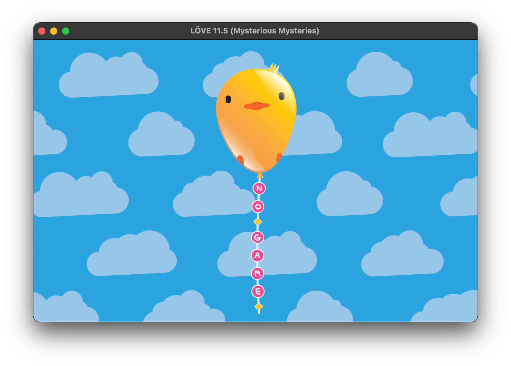
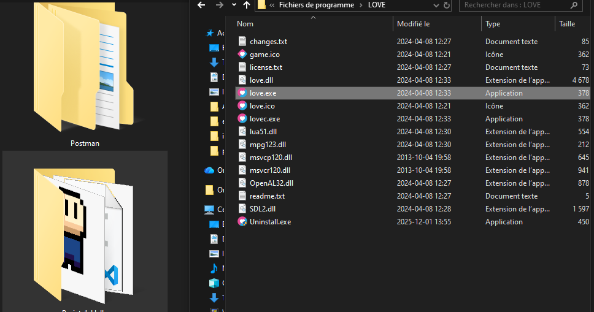

+++
title = "Introduction"
weight = 10
[params]
  author = 'Samy, Umar et Ashank'
+++
# 1.Introduction à LOVE2D
LÖVE2D, souvent appelé Love2D, est un framework open-source destiné à la création de jeux vidéo en 2D. Il utilise le langage de programmation Lua, reconnu pour sa simplicité, sa rapidité et sa facilité de prise en main. Love2D rend le développement très accessible grâce à sa structure claire et à son fonctionnement basé sur une boucle de jeu déjà intégrée, ce qui évite au développeur de devoir gérer lui-même les rafraîchissements de l’écran ou le timing des images.

Lua étant un langage interprété, l'exécution est rapide et les tests sont quasi immédiats, ce qui favorise l’expérimentation. Love2D est aussi extrêmement léger : un projet peut être constitué d’un seul fichier main.lua, ce qui permet aux débutants de se concentrer sur la logique du jeu plutôt que sur la configuration d’un environnement complexe.

Love2D repose sur trois fonctions fondamentales qui définissent la structure d’un projet :

```Lua
function love.load() end     -- exécuté une seule fois au début
function love.update(dt) end -- logique du jeu (environ 60fps)
function love.draw() end     --  partie visuelle du jeu
```

love.load() sert à initialiser les variables, charger les ressources et configurer le jeu. love.update(dt) traite les déplacements, animations, collisions ou IA. Le paramètre dt (delta time) représente le temps écoulé entre deux frames, ce qui permet d’avoir des mouvements constants quel que soit le FPS. Enfin, love.draw() se charge de tout l’affichage : texte, images, formes, sprites animés, etc.




## Installation

Télécharger LOVE2D ici :
https://love2d.org/


<a href="/fichiers/LOVE2D-CORRIGES.zip" download
   style="
       display:inline-block;
       background:#2563eb;
       color:white;
       padding:12px 20px;
       border-radius:8px;
       text-decoration:none;
       font-weight:600;
       margin-top:15px;
   ">
    Télécharger les corrigés aux exercises, le corrigé du projet final et les exemples (ZIP).
</a>


## 1.1 - Un exemple minimal 
Créer un fichier `main.lua` :

```txt
Projet-1-Hello/
    main.lua
```
Commande pour afficher un texte:
```Lua
function love.draw()
    love.graphics.print("Hello Love2D!", 100, 100)
end

```


## 1.2 - Demarrer un jeu avec Love2D (Drag and Drop)

1. Ouvrir `C:\Program Files\LOVE`
2. Trouver `love.exe`
3. Ouvrir l’explorateur Windows dans ton projet
4. Glisser ton dossier ENTIER sur `love.exe`

Comme ceci :



Projet-1-Hello -> glisser sur love.exe  
Le jeu démarre automatiquement 

---