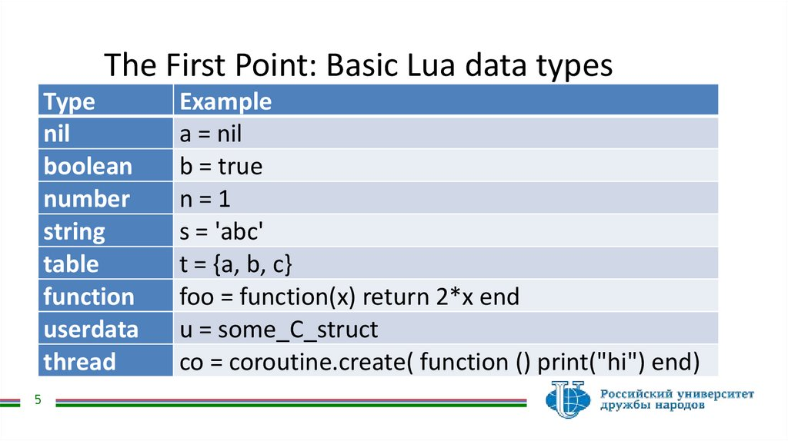

+++
title = "Notes de cours - LUA"
weight = 2
+++

Notes de cours sur votre sujet.

## Ques ce que LUA ?

Lua est un langage de programmation polyvalent, créé par Bjarne Stroustrup pour etndare le language c a de la programmation orienté objet tout en gardant les performance du C.

Lua est un langage de programmation léger, rapide et flexible, pensé pour être intégré à d’autres logiciels plutôt que d’être utilisé comme un langage autonome. Créé en 1993 au sein de l’Université Pontificale Catholique de Rio de Janeiro, Lua a gagné une popularité mondiale en raison de son efficacité, de sa simplicité et de sa capacité unique à s’intégrer dans des projets écrits en C et C++.

Contrairement à des langages comme Python, Java ou C++, Lua n’a pas été conçu pour devenir un langage généraliste destiné à remplacer les autres. Sa philosophie repose sur une idée simple : fournir un petit noyau extrêmement performant et minimaliste que les développeurs peuvent étendre selon leurs besoins. C’est un langage pensé comme un couteau suisse du scripting, capable d’être embarqué dans des moteurs de jeux, des systèmes embarqués, des logiciels métiers, ou des environnements nécessitant un langage de configuration.

Lua est apprécié pour sa petite taille, vitesse, facilité d'ntegration et sa syntaxe simple.

Lua se retrouve aujourd’hui dans des domaines aussi variés que l’industrie du jeu vidéo (Roblox, World of Warcraft, Angry Birds), les systèmes embarqués, la robotique, la cybersécurité, l’automatisation, et même les outils de configuration de Linux.

---

## Types

Lua possede ...

